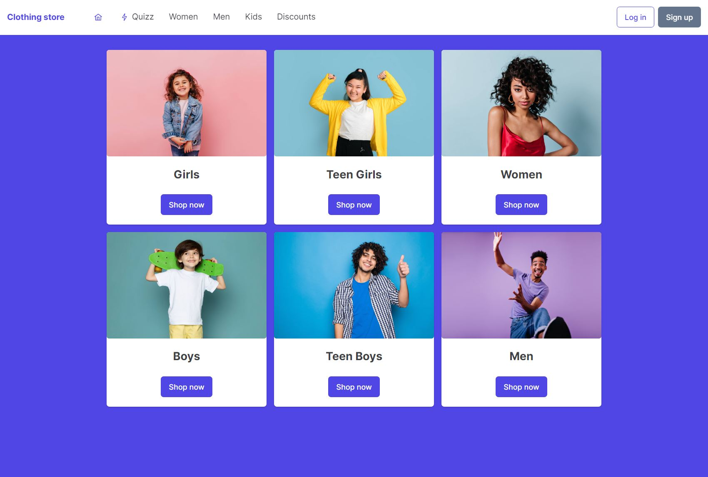

<h1 style="text-align: center;">Clothing store</h1>

 

## Technologies used
<table align="center">

  </tr>
    <td>
        
    </td>
    <td>
        
    </td>
     <td>
        
    </td>
  </tr>

  </tr>
    <td>
        
    </td>
    <td>
        
    </td>
     <td>
        
    </td>
  </tr>
  </tr>
    <td>
        
    </td>
  </tr>
</table>

 

|  | Technology | URL |
| ---  | ---        | --- |
|| React | <a href="URL"> https://es.reactjs.org/</a>  |
|| Vite | <a href="URL">	https://vitejs.dev/</a>  |
|| Prime React | <a href="URL">https://www.primefaces.org/primereact/	</a>  |
|| Axios | <a href="URL">https://axios-http.com/	</a>  |
|| Flask | <a href="URL">https://flask.palletsprojects.com/en/2.2.x/</a>  |
|| MongoDB | <a href="URL">https://www.mongodb.com/</a>  |
|| Insomnia | <a href="URL">https://insomnia.rest/</a>  |

